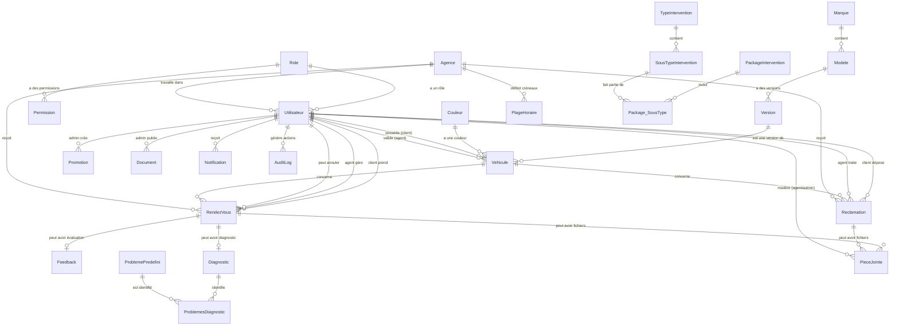

# Diagramme Complet de la Base de Données STA Chery Tunisia

## 📊 Schéma Relationnel Détaillé avec Attributs et Contraintes

### 🔑 Légende des Types de Données
- **PK** = Primary Key (Clé Primaire)
- **FK** = Foreign Key (Clé Étrangère)
- **UK** = Unique Key (Clé Unique)
- **NN** = Not Null (Non Null)
- **DF** = Default Value (Valeur par Défaut)

---

## 📋 TABLES DÉTAILLÉES

### 1. **Role** - Gestion des Rôles
```sql
┌─────────────────────────────────────────┐
│                  Role                   │
├─────────────────────────────────────────┤
│ PK  id              BIGINT IDENTITY     │
│ UK  nom             NVARCHAR(50) NN     │
│     description     NVARCHAR(200)       │
│ DF  actif           BIT DEFAULT 1       │
│ DF  date_creation   DATETIME2 DEFAULT   │
└─────────────────────────────────────────┘

Valeurs: CLIENT, AGENT, ADMIN, SUPER_ADMIN, DIRECTION
```

### 2. **Agence** - Centres de Service
```sql
┌─────────────────────────────────────────┐
│                 Agence                  │
├─────────────────────────────────────────┤
│ PK  id              BIGINT IDENTITY     │
│ NN  nom             NVARCHAR(150)       │
│     adresse         NVARCHAR(500)       │
│     telephone       NVARCHAR(20)        │
│     email           NVARCHAR(255)       │
│     ville           NVARCHAR(100)       │
│     code_postal     NVARCHAR(10)        │
│ DF  actif           BIT DEFAULT 1       │
│ DF  date_creation   DATETIME2 DEFAULT   │
└─────────────────────────────────────────┘
```

### 3. **Utilisateur** - Utilisateurs du Système
```sql
┌─────────────────────────────────────────┐
│               Utilisateur               │
├─────────────────────────────────────────┤
│ PK  id                  BIGINT IDENTITY │
│ NN  nom                 NVARCHAR(100)   │
│ NN  prenom              NVARCHAR(100)   │
│ UK  email               NVARCHAR(255)   │
│ NN  mot_de_passe        NVARCHAR(255)   │
│     telephone           NVARCHAR(20)    │
│ DF  telephone_verifie   BIT DEFAULT 0   │
│     code_client         NVARCHAR(50)    │
│     adresse             NVARCHAR(500)   │
│ FK  role_id             BIGINT NN       │
│ FK  agence_id           BIGINT          │
│ DF  actif               BIT DEFAULT 1   │
│ DF  date_creation       DATETIME2 DEF   │
└─────────────────────────────────────────┘

FOREIGN KEYS:
- role_id → Role(id)
- agence_id → Agence(id)
```

### 4. **Permission** - Contrôle d'Accès
```sql
┌─────────────────────────────────────────┐
│               Permission                │
├─────────────────────────────────────────┤
│ PK  id          BIGINT IDENTITY         │
│ FK  role_id     BIGINT NN               │
│ NN  module      NVARCHAR(100)           │
│ NN  action      NVARCHAR(100)           │
└─────────────────────────────────────────┘

FOREIGN KEYS:
- role_id → Role(id)

Modules: users, vehicles, appointments, complaints, etc.
Actions: create, read, update, delete, approve, etc.
```

### 5. **Marque** - Marques de Véhicules
```sql
┌─────────────────────────────────────────┐
│                 Marque                  │
├─────────────────────────────────────────┤
│ PK  id      BIGINT IDENTITY             │
│ NN  nom     NVARCHAR(100)               │
│ DF  actif   BIT DEFAULT 1               │
└─────────────────────────────────────────┘

Valeurs: Chery, Toyota, Renault, etc.
```

### 6. **Modele** - Modèles de Véhicules
```sql
┌─────────────────────────────────────────┐
│                 Modele                  │
├─────────────────────────────────────────┤
│ PK  id          BIGINT IDENTITY         │
│ FK  marque_id   BIGINT NN               │
│ NN  nom         NVARCHAR(150)           │
│ DF  actif       BIT DEFAULT 1           │
└─────────────────────────────────────────┘

FOREIGN KEYS:
- marque_id → Marque(id)

Exemples: Tiggo 7, Tiggo 8, Arrizo 6, etc.
```

### 7. **Version** - Versions/Finitions
```sql
┌─────────────────────────────────────────┐
│                Version                  │
├─────────────────────────────────────────┤
│ PK  id          BIGINT IDENTITY         │
│ FK  modele_id   BIGINT NN               │
│ NN  nom         NVARCHAR(150)           │
│     annee       INT                     │
│ DF  actif       BIT DEFAULT 1           │
└─────────────────────────────────────────┘

FOREIGN KEYS:
- modele_id → Modele(id)

Exemples: Comfort, Luxury, Sport, etc.
```

### 8. **Couleur** - Couleurs Disponibles
```sql
┌─────────────────────────────────────────┐
│                Couleur                  │
├─────────────────────────────────────────┤
│ PK  id              BIGINT IDENTITY     │
│ NN  nom             NVARCHAR(50)        │
│     code_hex        VARCHAR(7)          │
│ DF  actif           BIT DEFAULT 1       │
│ DF  date_creation   DATETIME2 DEFAULT   │
└─────────────────────────────────────────┘

Exemples: Blanc (#FFFFFF), Noir (#000000), etc.
```

### 9. **Vehicule** - Véhicules Clients
```sql
┌─────────────────────────────────────────┐
│                Vehicule                 │
├─────────────────────────────────────────┤
│ PK  id                      BIGINT ID   │
│ FK  client_id               BIGINT NN   │
│ FK  version_id              BIGINT NN   │
│ FK  couleur_id              BIGINT      │
│ UK  numero_chassis          NVARCHAR(50)│
│     numero_immatriculation  NVARCHAR(20)│
│     date_achat              DATE        │
│     kilometrage             INT         │
│     image_vehicule          NVARCHAR(500)│
│     image_carte_grise       NVARCHAR(500)│
│ DF  statut_validation       VARCHAR(20) │
│ FK  agent_validation_id     BIGINT      │
│     date_validation         DATETIME2   │
│     commentaire_validation  NVARCHAR(500)│
│ DF  actif                   BIT DEF 1   │
│ DF  date_creation           DATETIME2 D │
└─────────────────────────────────────────┘

FOREIGN KEYS:
- client_id → Utilisateur(id)
- version_id → Version(id)
- couleur_id → Couleur(id)
- agent_validation_id → Utilisateur(id)

CONSTRAINTS:
- statut_validation IN ('EN_ATTENTE', 'VALIDE', 'REFUSE')
```

### 10. **PlageHoraire** - Créneaux Horaires
```sql
┌─────────────────────────────────────────┐
│              PlageHoraire               │
├─────────────────────────────────────────┤
│ PK  id              BIGINT IDENTITY     │
│ FK  agence_id       BIGINT NN           │
│ NN  jour_semaine    TINYINT             │
│ NN  heure_debut     TIME                │
│ NN  heure_fin       TIME                │
│ DF  capacite        INT DEFAULT 5       │
│ DF  actif           BIT DEFAULT 1       │
│ DF  date_creation   DATETIME2 DEFAULT   │
└─────────────────────────────────────────┘

FOREIGN KEYS:
- agence_id → Agence(id)

CONSTRAINTS:
- jour_semaine: 0=Dimanche, 1=Lundi, ..., 6=Samedi
- heure_debut < heure_fin
```

### 11. **RendezVous** - Rendez-vous Clients
```sql
┌─────────────────────────────────────────┐
│               RendezVous                │
├─────────────────────────────────────────┤
│ PK  id                      BIGINT ID   │
│ FK  client_id               BIGINT NN   │
│ FK  vehicule_id             BIGINT NN   │
│ FK  agence_id               BIGINT NN   │
│ FK  agent_id                BIGINT      │
│ NN  date_heure              DATETIME2   │
│     type_intervention       NVARCHAR(100)│
│     description_probleme    NVARCHAR(1000)│
│ DF  statut                  NVARCHAR(50)│
│ DF  priorite                NVARCHAR(20)│
│ FK  utilisateur_annulation  BIGINT      │
│     raison_annulation       NVARCHAR(500)│
│     date_annulation         DATETIME2   │
│ DF  date_creation           DATETIME2 D │
└─────────────────────────────────────────┘

FOREIGN KEYS:
- client_id → Utilisateur(id)
- vehicule_id → Vehicule(id)
- agence_id → Agence(id)
- agent_id → Utilisateur(id)
- utilisateur_annulation → Utilisateur(id)

CONSTRAINTS:
- statut IN ('EN_ATTENTE', 'CONFIRME', 'EN_COURS', 'TERMINE', 'ANNULE')
- priorite IN ('FAIBLE', 'NORMALE', 'HAUTE', 'URGENTE')
```

### 12. **Reclamation** - Réclamations Clients
```sql
┌─────────────────────────────────────────┐
│              Reclamation                │
├─────────────────────────────────────────┤
│ PK  id              BIGINT IDENTITY     │
│ FK  client_id       BIGINT NN           │
│ FK  vehicule_id     BIGINT              │
│ FK  agence_id       BIGINT              │
│ FK  agent_id        BIGINT              │
│ NN  titre           NVARCHAR(200)       │
│ NN  description     NVARCHAR(2000)      │
│ DF  statut          NVARCHAR(50)        │
│ DF  priorite        NVARCHAR(20)        │
│ DF  date_creation   DATETIME2 DEFAULT   │
│     date_resolution DATETIME2           │
│     appointment_id  BIGINT              │
└─────────────────────────────────────────┘

FOREIGN KEYS:
- client_id → Utilisateur(id)
- vehicule_id → Vehicule(id)
- agence_id → Agence(id)
- agent_id → Utilisateur(id)

CONSTRAINTS:
- statut IN ('OUVERTE', 'EN_COURS', 'RESOLUE', 'FERMEE')
- priorite IN ('FAIBLE', 'NORMALE', 'HAUTE', 'URGENTE')
```

### 13. **ProblemePredefini** - Catalogue des Problèmes
```sql
┌─────────────────────────────────────────┐
│           ProblemePredefini             │
├─────────────────────────────────────────┤
│ PK  id              BIGINT IDENTITY     │
│ NN  nom             NVARCHAR(150)       │
│     description     NVARCHAR(MAX)       │
│     solution        NVARCHAR(MAX)       │
│ NN  categorie       NVARCHAR(50)        │
│ DF  actif           BIT DEFAULT 1       │
│ DF  date_creation   DATETIME2 DEFAULT   │
└─────────────────────────────────────────┘

Catégories: Moteur, Freinage, Climatisation, Électrique, etc.
```

### 14. **Diagnostic** - Diagnostics Techniques
```sql
┌─────────────────────────────────────────┐
│               Diagnostic                │
├─────────────────────────────────────────┤
│ PK  id                  BIGINT IDENTITY │
│ FK  rdv_id              BIGINT NN       │
│ FK  agent_id            BIGINT NN       │
│     symptomes           NVARCHAR(1000)  │
│     diagnostic_initial  NVARCHAR(1000)  │
│     actions_effectuees  NVARCHAR(2000)  │
│     pieces_utilisees    NVARCHAR(1000)  │
│     temps_intervention  INT             │
│     cout_total          DECIMAL(10,3)   │
│ DF  statut              NVARCHAR(50)    │
│ DF  date_creation       DATETIME2 DEF   │
│     date_finalisation   DATETIME2       │
│     date_modification   DATETIME2       │
└─────────────────────────────────────────┘

FOREIGN KEYS:
- rdv_id → RendezVous(id)
- agent_id → Utilisateur(id)

CONSTRAINTS:
- statut IN ('EN_COURS', 'TERMINE', 'SUSPENDU')
- temps_intervention en minutes
```

### 15. **ProblemesDiagnostic** - Liaison Diagnostic-Problèmes
```sql
┌─────────────────────────────────────────┐
│           ProblemesDiagnostic           │
├─────────────────────────────────────────┤
│ PK  id                  BIGINT IDENTITY │
│ FK  diagnostic_id       BIGINT NN       │
│ FK  probleme_id         BIGINT NN       │
│     gravite             NVARCHAR(20)    │
│ DF  date_ajout          DATETIME2 DEF   │
└─────────────────────────────────────────┘

FOREIGN KEYS:
- diagnostic_id → Diagnostic(id) ON DELETE CASCADE
- probleme_id → ProblemePredefini(id)

Gravité: FAIBLE, MOYENNE, ELEVEE, CRITIQUE
```

### 16. **TypeIntervention** - Types d'Interventions
```sql
┌─────────────────────────────────────────┐
│            TypeIntervention             │
├─────────────────────────────────────────┤
│ PK  id          BIGINT IDENTITY         │
│ NN  nom         NVARCHAR(150)           │
│     description NVARCHAR(500)           │
│ DF  actif       BIT DEFAULT 1           │
└─────────────────────────────────────────┘

Exemples: Entretien, Réparation, Diagnostic, etc.
```

### 17. **SousTypeIntervention** - Sous-types d'Interventions
```sql
┌─────────────────────────────────────────┐
│          SousTypeIntervention           │
├─────────────────────────────────────────┤
│ PK  id                      BIGINT ID   │
│ FK  type_intervention_id    BIGINT NN   │
│ NN  nom                     NVARCHAR(150)│
│     description             NVARCHAR(500)│
│     prix                    DECIMAL(10,3)│
│     duree_estimee           NVARCHAR(50) │
│ DF  actif                   BIT DEF 1    │
└─────────────────────────────────────────┘

FOREIGN KEYS:
- type_intervention_id → TypeIntervention(id)

Exemples: Vidange, Changement plaquettes, etc.
```

### 18. **PackageIntervention** - Forfaits de Services
```sql
┌─────────────────────────────────────────┐
│           PackageIntervention           │
├─────────────────────────────────────────┤
│ PK  id              BIGINT IDENTITY     │
│ NN  nom             NVARCHAR(150)       │
│     description     NVARCHAR(500)       │
│ NN  prix            DECIMAL(10,3)       │
│     duree_estimee   NVARCHAR(50)        │
│ DF  actif           BIT DEFAULT 1       │
│ DF  date_creation   DATETIME2 DEFAULT   │
└─────────────────────────────────────────┘

Exemples: Entretien Complet, Révision 10000km, etc.
```

### 19. **Package_SousType** - Liaison Package-SousType
```sql
┌─────────────────────────────────────────┐
│            Package_SousType             │
├─────────────────────────────────────────┤
│ PK  id              BIGINT IDENTITY     │
│ FK  package_id      BIGINT NN           │
│ FK  sous_type_id    BIGINT NN           │
└─────────────────────────────────────────┘

FOREIGN KEYS:
- package_id → PackageIntervention(id)
- sous_type_id → SousTypeIntervention(id)
```

### 20. **PieceJointe** - Fichiers et Modération
```sql
┌─────────────────────────────────────────┐
│              PieceJointe                │
├─────────────────────────────────────────┤
│ PK  id                      BIGINT ID   │
│ NN  entite_type             NVARCHAR(20)│
│ NN  entite_id               BIGINT      │
│ NN  url                     NVARCHAR(255)│
│     type_mime               NVARCHAR(100)│
│     taille_mo               DECIMAL(8,2) │
│ DF  date_upload             DATETIME2 D  │
│ DF  statut_moderation       NVARCHAR(20) │
│ FK  modere_par              BIGINT       │
│     date_moderation         DATETIME2    │
│     commentaire_moderation  NVARCHAR(500)│
└─────────────────────────────────────────┘

FOREIGN KEYS:
- modere_par → Utilisateur(id)

CONSTRAINTS:
- entite_type IN ('RDV', 'RECLAMATION')
- statut_moderation IN ('EN_ATTENTE', 'APPROUVE', 'REJETE')
```

### 21. **Feedback** - Évaluations Clients
```sql
┌─────────────────────────────────────────┐
│                Feedback                 │
├─────────────────────────────────────────┤
│ PK  id              BIGINT IDENTITY     │
│ FK  rendez_vous_id  BIGINT NN           │
│     appointment_id  BIGINT              │
│ NN  note            INT                 │
│     commentaire     NVARCHAR(1000)      │
│ DF  date_feedback   DATETIME2 DEFAULT   │
└─────────────────────────────────────────┘

FOREIGN KEYS:
- rendez_vous_id → RendezVous(id)

CONSTRAINTS:
- note CHECK (note >= 1 AND note <= 5)
```

### 22. **Promotion** - Promotions Commerciales
```sql
┌─────────────────────────────────────────┐
│               Promotion                 │
├─────────────────────────────────────────┤
│ PK  id              BIGINT IDENTITY     │
│ FK  admin_id        BIGINT NN           │
│ NN  titre           NVARCHAR(200)       │
│     description     NVARCHAR(MAX)       │
│     image_url       NVARCHAR(500)       │
│ NN  date_debut      DATE                │
│ NN  date_fin        DATE                │
│ DF  actif           BIT DEFAULT 1       │
│ DF  date_creation   DATETIME2 DEFAULT   │
└─────────────────────────────────────────┘

FOREIGN KEYS:
- admin_id → Utilisateur(id)

CONSTRAINTS:
- date_debut < date_fin
```

### 23. **Document** - Documents Système
```sql
┌─────────────────────────────────────────┐
│                Document                 │
├─────────────────────────────────────────┤
│ PK  id              BIGINT IDENTITY     │
│ NN  titre           NVARCHAR(200)       │
│     description     NVARCHAR(MAX)       │
│ NN  url             NVARCHAR(500)       │
│ NN  categorie       NVARCHAR(50)        │
│     type_mime       NVARCHAR(100)       │
│     taille_mo       DECIMAL(8,2)        │
│ FK  admin_id        BIGINT NN           │
│ DF  actif           BIT DEFAULT 1       │
│ DF  date_creation   DATETIME2 DEFAULT   │
└─────────────────────────────────────────┘

FOREIGN KEYS:
- admin_id → Utilisateur(id)

Catégories: Garantie, Assurance, SAV, Manuel
```

### 24. **Notification** - Système de Notifications
```sql
┌─────────────────────────────────────────┐
│              Notification               │
├─────────────────────────────────────────┤
│ PK  id              BIGINT IDENTITY     │
│ FK  utilisateur_id  BIGINT NN           │
│ NN  titre           NVARCHAR(200)       │
│ NN  message         NVARCHAR(1000)      │
│ DF  type            NVARCHAR(50)        │
│     entite_type     NVARCHAR(20)        │
│     entite_id       BIGINT              │
│ DF  lu              BIT DEFAULT 0       │
│ DF  date_creation   DATETIME2 DEFAULT   │
│     date_envoi      DATETIME2           │
└─────────────────────────────────────────┘

FOREIGN KEYS:
- utilisateur_id → Utilisateur(id)

Types: INFO, WARNING, ERROR, SUCCESS, PUSH
```

### 25. **AuditLog** - Journal d'Audit
```sql
┌─────────────────────────────────────────┐
│                AuditLog                 │
├─────────────────────────────────────────┤
│ PK  id              BIGINT IDENTITY     │
│ FK  utilisateur_id  BIGINT              │
│ NN  action          NVARCHAR(100)       │
│     table_name      NVARCHAR(100)       │
│     record_id       BIGINT              │
│     old_values      NVARCHAR(MAX)       │
│     new_values      NVARCHAR(MAX)       │
│     ip_address      NVARCHAR(45)        │
│     user_agent      NVARCHAR(500)       │
│     erreur_message  NVARCHAR(MAX)       │
│ DF  date_action     DATETIME2 DEFAULT   │
└─────────────────────────────────────────┘

FOREIGN KEYS:
- utilisateur_id → Utilisateur(id)

Actions: CREATE, UPDATE, DELETE, LOGIN, LOGOUT, etc.
```

---

## 🔗 DIAGRAMME DES RELATIONS



---

## 📊 CARDINALITÉS ET CONTRAINTES

### **Relations 1:N (Un vers Plusieurs)**
- `Role(1)` → `Utilisateur(N)` : Un rôle pour plusieurs utilisateurs
- `Agence(1)` → `Utilisateur(N)` : Une agence emploie plusieurs agents
- `Utilisateur(1)` → `Vehicule(N)` : Un client peut avoir plusieurs véhicules
- `Vehicule(1)` → `RendezVous(N)` : Un véhicule peut avoir plusieurs RDV
- `RendezVous(1)` → `PieceJointe(N)` : Un RDV peut avoir plusieurs fichiers

### **Relations 1:1 (Un vers Un)**
- `RendezVous(1)` → `Diagnostic(0..1)` : Un RDV peut avoir un diagnostic
- `RendezVous(1)` → `Feedback(0..1)` : Un RDV peut avoir une évaluation

### **Relations N:N (Plusieurs vers Plusieurs)**
- `PackageIntervention` ↔ `SousTypeIntervention` via `Package_SousType`
- `Diagnostic` ↔ `ProblemePredefini` via `ProblemesDiagnostic`

### **Contraintes Métier Importantes**
1. **Validation Véhicules** : Seuls les véhicules `VALIDE` peuvent prendre RDV
2. **Modération Fichiers** : Clients voient seulement fichiers `APPROUVE`
3. **Rôles et Permissions** : Contrôle d'accès strict par module/action
4. **Dates Cohérentes** : `date_debut < date_fin` pour promotions
5. **Notes Feedback** : Entre 1 et 5 étoiles obligatoirement

Cette structure garantit l'intégrité des données, la sécurité et la traçabilité complète du système STA Chery Tunisia.