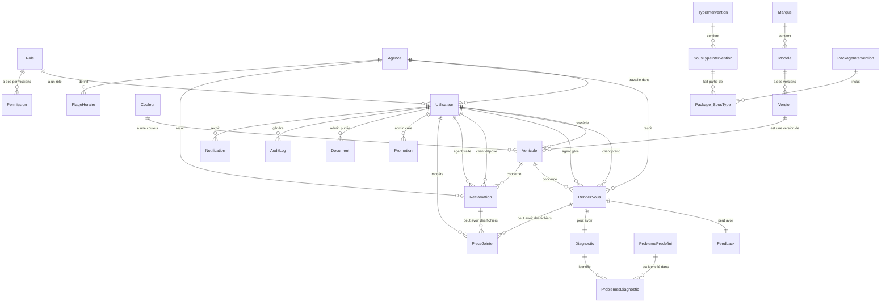

# Diagramme des Relations - Base de Données STA Chery Tunisia

## 🎯 Diagramme Entité-Relation Principal



## 🏗️ Architecture par Modules

### **Module Utilisateurs**
```
┌─────────────────┐    ┌─────────────────┐    ┌─────────────────┐
│      Role       │────│   Utilisateur   │────│     Agence      │
│                 │    │                 │    │                 │
│ • CLIENT        │    │ • Données perso │    │ • Localisation  │
│ • AGENT         │    │ • Authentif.    │    │ • Horaires      │
│ • ADMIN         │    │ • Vérification  │    │ • Capacité      │
│ • DIRECTION     │    │ • Statut        │    │                 │
└─────────────────┘    └─────────────────┘    └─────────────────┘
         │                       │                       │
         └───────────────────────┼───────────────────────┘
                                 │
                    ┌─────────────────┐
                    │   Permission    │
                    │                 │
                    │ • Module        │
                    │ • Action        │
                    │ • Contrôle      │
                    └─────────────────┘
```

### **Module Véhicules**
```
┌─────────────┐    ┌─────────────┐    ┌─────────────┐    ┌─────────────┐
│   Marque    │────│   Modele    │────│   Version   │────│  Vehicule   │
│             │    │             │    │             │    │             │
│ • Chery     │    │ • Tiggo     │    │ • 2023      │    │ • Chassis   │
│ • Autres    │    │ • Arrizo    │    │ • Moteur    │    │ • Immat.    │
└─────────────┘    └─────────────┘    └─────────────┘    │ • Validation│
                                                          └─────────────┘
                                                                  │
                                                          ┌─────────────┐
                                                          │   Couleur   │
                                                          │             │
                                                          │ • Nom       │
                                                          │ • Code Hex  │
                                                          └─────────────┘
```

### **Module Services**
```
┌─────────────────┐    ┌─────────────────┐    ┌─────────────────┐
│   RendezVous    │────│   Diagnostic    │────│ ProblemePredef  │
│                 │    │                 │    │                 │
│ • Planification │    │ • Symptômes     │    │ • Catalogue     │
│ • Statut        │    │ • Actions       │    │ • Solutions     │
│ • Priorité      │    │ • Coût          │    │ • Catégories    │
└─────────────────┘    └─────────────────┘    └─────────────────┘
         │                       │
         │              ┌─────────────────┐
         └──────────────│    Feedback     │
                        │                 │
                        │ • Note 1-5      │
                        │ • Commentaire   │
                        └─────────────────┘
```

### **Module Réclamations**
```
┌─────────────────┐    ┌─────────────────┐
│   Reclamation   │────│   PieceJointe   │
│                 │    │                 │
│ • Titre         │    │ • Fichiers      │
│ • Description   │    │ • Modération    │
│ • Statut        │    │ • Validation    │
│ • Priorité      │    │                 │
└─────────────────┘    └─────────────────┘
```

## 🔄 Flux de Données Principaux

### **1. Flux d'Inscription Client**
```
Client s'inscrit → Utilisateur créé (role: CLIENT) → Véhicule ajouté → Validation Agent → Véhicule validé
```

### **2. Flux de Prise de Rendez-vous**
```
Client connecté → Sélectionne véhicule → Choisit agence/créneau → RendezVous créé → Agent assigné → Service effectué
```

### **3. Flux de Diagnostic**
```
RendezVous confirmé → Agent effectue diagnostic → Problèmes identifiés → Actions documentées → Feedback client
```

### **4. Flux de Modération Fichiers**
```
Client upload fichier → PieceJointe (EN_ATTENTE) → Agent/Admin modère → APPROUVE/REJETE → Client informé
```

### **5. Flux de Réclamation**
```
Client dépose réclamation → Reclamation créée → Agent assigné → Traitement → Résolution → Fermeture
```

## 📊 Cardinalités Importantes

### **Relations 1:N (Un vers Plusieurs)**
- `Utilisateur` (1) → `Vehicule` (N) : Un client peut avoir plusieurs véhicules
- `Agence` (1) → `RendezVous` (N) : Une agence reçoit plusieurs RDV
- `RendezVous` (1) → `PieceJointe` (N) : Un RDV peut avoir plusieurs fichiers
- `Utilisateur` (1) → `Reclamation` (N) : Un client peut avoir plusieurs réclamations

### **Relations 1:1 (Un vers Un)**
- `RendezVous` (1) → `Diagnostic` (1) : Un RDV a au maximum un diagnostic
- `RendezVous` (1) → `Feedback` (1) : Un RDV a au maximum un feedback

### **Relations N:N (Plusieurs vers Plusieurs)**
- `PackageIntervention` ↔ `SousTypeIntervention` : Via table `Package_SousType`
- `Diagnostic` ↔ `ProblemePredefini` : Via table `ProblemesDiagnostic`

## 🔐 Contraintes de Sécurité

### **Isolation par Rôle**
```sql
-- Les clients ne voient que leurs données
WHERE client_id = @current_user_id

-- Les agents voient les données de leur agence
WHERE agence_id = @user_agence_id

-- Les admins voient tout
-- Pas de restriction WHERE
```

### **Modération des Fichiers**
```sql
-- Clients voient seulement les fichiers approuvés
WHERE statut_moderation = 'APPROUVE'

-- Agents/Admins voient tous les fichiers
-- Pas de restriction sur statut_moderation
```

### **Validation des Véhicules**
```sql
-- Seuls les véhicules validés sont utilisables pour RDV
WHERE statut_validation = 'VALIDE'
```

## 📈 Optimisations et Performance

### **Index Critiques**
- `Utilisateur.email` : Connexion fréquente
- `RendezVous.date_heure` : Recherche par date
- `PieceJointe.statut_moderation` : Filtrage modération
- `Vehicule.client_id` : Recherche véhicules client

### **Vues Matérialisées Recommandées**
- `VueStatistiquesAgence` : Performances par agence
- `VuePlanningAgent` : Planning des agents
- `VueTableauBordDirection` : KPIs direction

Cette architecture garantit une séparation claire des responsabilités, une sécurité robuste et des performances optimales pour le système STA Chery Tunisia.