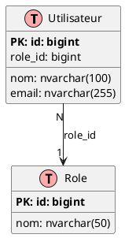

# Guide d'Extraction du Schéma pour Conception UML 📊

## Vue d'ensemble

Ce guide vous explique comment extraire le schéma complet de votre base de données pour créer des diagrammes UML (diagrammes de classes, diagrammes entité-relation, etc.).

---

## 🎯 Objectif

Extraire automatiquement:
- ✅ Toutes les tables et leurs attributs
- ✅ Les types de données et contraintes
- ✅ Les clés primaires et étrangères
- ✅ Les relations entre tables
- ✅ Les cardinalités

---

## 📋 Méthodes d'Extraction

### Méthode 1: Script Node.js (Recommandé) ⭐

**Avantages**: Génère plusieurs formats (JSON, Markdown, CSV)

```bash
# Depuis la racine du projet
node backend/scripts/generateUMLSchema.js
```

**Fichiers générés dans `docs/uml/`**:
- `database_schema.json` - Format structuré pour outils
- `database_schema.md` - Documentation lisible
- `database_schema.csv` - Pour Excel/LibreOffice
- `database_relations.csv` - Relations pour diagrammes

---

### Méthode 2: Script SQL Direct

**Avantages**: Résultats immédiats dans SSMS

```bash
# Avec sqlcmd
sqlcmd -S localhost -d STA_SAV_DB -U dali -P Daligh2004 -i backend/scripts/extract_database_schema_for_uml.sql

# Ou ouvrir dans SQL Server Management Studio (SSMS)
```

**Résultats affichés**:
1. Liste des tables
2. Détails des colonnes
3. Clés primaires
4. Clés étrangères et relations
5. Index
6. Vues
7. Contraintes UNIQUE
8. Contraintes CHECK
9. Résumé statistique
10. Diagramme de relations (texte)

---

### Méthode 3: Export CSV Simple

```bash
sqlcmd -S localhost -d STA_SAV_DB -U dali -P Daligh2004 -i backend/scripts/export_schema_to_csv.sql -o schema_output.csv
```

---

## 📊 Utilisation des Fichiers Générés

### Pour Diagrammes UML avec PlantUML

Utilisez le fichier JSON pour générer automatiquement du code PlantUML:



---

### Pour Diagrammes avec Draw.io / Lucidchart

1. Ouvrez `database_schema.csv` dans Excel
2. Importez dans Draw.io:
   - File → Import → CSV
   - Sélectionnez le fichier
   - Configurez les colonnes

---

### Pour Diagrammes avec MySQL Workbench / DbSchema

1. Utilisez `database_schema.json`
2. Importez via:
   - Database → Reverse Engineer
   - Sélectionnez "Import from JSON"

---

## 📐 Structure des Données Extraites

### Format JSON

```json
{
  "database": "STA_SAV_DB",
  "generated_at": "2026-05-01T10:00:00.000Z",
  "tables": [
    {
      "name": "Utilisateur",
      "schema": "dbo",
      "columns": [
        {
          "name": "id",
          "type": "bigint",
          "nullable": false,
          "primary_key": true,
          "foreign_key": false,
          "auto_increment": true
        }
      ],
      "foreign_keys": [
        {
          "constraint_name": "FK_Utilisateur_Role",
          "column": "role_id",
          "references_table": "Role",
          "references_column": "id",
          "on_delete": "NO ACTION"
        }
      ]
    }
  ]
}
```

---

### Format CSV

```csv
Table,Colonne,Type,Taille,Nullable,PK,FK,Auto
Utilisateur,id,bigint,,NON,OUI,NON,OUI
Utilisateur,nom,nvarchar,100,NON,NON,NON,NON
Utilisateur,email,nvarchar,255,NON,NON,NON,NON
Utilisateur,role_id,bigint,,OUI,NON,OUI,NON
```

---

## 🎨 Création de Diagrammes UML

### Diagramme de Classes

**Éléments à inclure**:
- Nom de la classe (= nom de la table)
- Attributs (= colonnes)
- Types de données
- Visibilité (+ public, - private, # protected)
- Stéréotypes (<<entity>>, <<table>>)

**Exemple**:
```
┌─────────────────────────┐
│   <<entity>>            │
│   Utilisateur           │
├─────────────────────────┤
│ - id: bigint {PK}       │
│ - nom: nvarchar(100)    │
│ - email: nvarchar(255)  │
│ - role_id: bigint {FK}  │
│ - date_creation: date   │
├─────────────────────────┤
│ + register()            │
│ + login()               │
│ + updateProfile()       │
└─────────────────────────┘
```

---

### Diagramme Entité-Association (ERD)

**Cardinalités**:
- `1..1` : Un à un
- `1..N` : Un à plusieurs
- `N..N` : Plusieurs à plusieurs
- `0..1` : Zéro ou un
- `0..N` : Zéro ou plusieurs

**Exemple**:
```
Utilisateur (1) ──────< (N) Vehicule
     │
     │ (N)
     │
     └──────> (1) Role
```

---

## 🔍 Informations Extraites

### 1. Tables
- Nom de la table
- Schéma (dbo)
- Nombre de colonnes

### 2. Colonnes
- Nom
- Type de données
- Taille/Précision
- Nullable (OUI/NON)
- Clé primaire (🔑)
- Clé étrangère (🔗)
- Auto-incrémenté
- Valeur par défaut

### 3. Relations
- Table source
- Colonne source
- Table cible
- Colonne cible
- Action ON DELETE
- Action ON UPDATE

### 4. Contraintes
- Clés primaires
- Clés étrangères
- Contraintes UNIQUE
- Contraintes CHECK
- Index

---

## 📝 Exemple Complet

### Étape 1: Extraction

```bash
node backend/scripts/generateUMLSchema.js
```

**Sortie**:
```
============================================================================
GÉNÉRATION DU SCHÉMA UML DE LA BASE DE DONNÉES
============================================================================

📊 Extraction des tables...
   ✅ 45 tables trouvées
📋 Extraction des colonnes...
   ✅ 387 colonnes trouvées
🔗 Extraction des relations...
   ✅ 52 relations trouvées

📝 Génération des fichiers de sortie...
   ✅ JSON: docs/uml/database_schema.json
   ✅ Markdown: docs/uml/database_schema.md
   ✅ CSV: docs/uml/database_schema.csv
   ✅ Relations CSV: docs/uml/database_relations.csv

============================================================================
✅ GÉNÉRATION TERMINÉE AVEC SUCCÈS!
============================================================================
```

---

### Étape 2: Ouvrir les Fichiers

```bash
# Voir le Markdown
cat docs/uml/database_schema.md

# Ouvrir le CSV dans Excel
start docs/uml/database_schema.csv

# Voir le JSON
cat docs/uml/database_schema.json
```

---

### Étape 3: Créer le Diagramme

**Option A: PlantUML**
1. Installez PlantUML
2. Créez un fichier `.puml` basé sur le JSON
3. Générez le diagramme: `plantuml diagram.puml`

**Option B: Draw.io**
1. Ouvrez Draw.io
2. File → Import → CSV
3. Sélectionnez `database_schema.csv`
4. Ajustez la mise en page

**Option C: Lucidchart**
1. Créez un nouveau diagramme ERD
2. Importez depuis CSV
3. Ajoutez les relations manuellement

---

## 🛠️ Outils Recommandés

### Outils de Diagrammes UML

1. **PlantUML** (Gratuit, Open Source)
   - Format texte
   - Génération automatique
   - Intégration VS Code

2. **Draw.io** (Gratuit, Web/Desktop)
   - Interface visuelle
   - Export PNG/SVG/PDF
   - Collaboration

3. **Lucidchart** (Payant, Web)
   - Professionnel
   - Collaboration en temps réel
   - Templates

4. **StarUML** (Payant, Desktop)
   - Complet
   - Support UML 2.0
   - Génération de code

5. **Visual Paradigm** (Payant, Desktop)
   - Très complet
   - Reverse engineering
   - Documentation automatique

---

## 📚 Ressources

### Documentation UML
- [UML Class Diagrams](https://www.uml-diagrams.org/class-diagrams.html)
- [Entity-Relationship Diagrams](https://www.lucidchart.com/pages/er-diagrams)
- [PlantUML Guide](https://plantuml.com/class-diagram)

### Outils
- [PlantUML Online](http://www.plantuml.com/plantuml/uml/)
- [Draw.io](https://app.diagrams.net/)
- [Lucidchart](https://www.lucidchart.com/)

---

## ✅ Checklist

- [ ] Exécuter le script d'extraction
- [ ] Vérifier les fichiers générés dans `docs/uml/`
- [ ] Ouvrir et examiner le fichier Markdown
- [ ] Importer le CSV dans votre outil de diagramme
- [ ] Créer le diagramme de classes
- [ ] Créer le diagramme ERD
- [ ] Ajouter les cardinalités
- [ ] Documenter les relations
- [ ] Exporter en PDF/PNG
- [ ] Inclure dans le rapport de conception

---

## 🎯 Résultat Attendu

Après avoir suivi ce guide, vous aurez:

✅ Un fichier JSON structuré avec tout le schéma  
✅ Une documentation Markdown complète  
✅ Des fichiers CSV pour import dans outils  
✅ Toutes les informations pour créer vos diagrammes UML  
✅ Une base solide pour la conception  

---

**Bon travail sur votre conception UML!** 🎨📐

---

**Date**: Mai 2026  
**Base de données**: STA_SAV_DB  
**Projet**: STA Chery Tunisia - Système SAV
